Backend service for the AudioVisualiser application. A Spring Boot RestfulAPI. Uses JWT authentication, and uses a HikariCP SQLite implementation for persistant data storage. This API services the OpenAI API, and will soon service Google's Youtube API so that users can direct export their renders to youtube. 

```mermaid
flowchart TD

subgraph group_api["REST API"]
  node_auth_controller["Auth Controller"]
  node_home_controller["Home Controller"]
  node_prompt_controller["Prompt Controller"]
  node_render_controller["Render Controller"]
end

subgraph group_security["Security"]
  node_security_filter["Security Filter"]
  node_token_service["Token Service<br/>[TokenService.java]"]
  node_jwt_keys["JWT Keys"]
  node_jdbc_users["JDBC Users"]
end

subgraph group_storage["Persistence"]
  node_sqlite_store[("SQLite Store<br/>[application.yaml]")]
  node_render_dao["Render DAO"]
  node_render_state["Render State<br/>[RenderState.java]"]
end

subgraph group_ai["Generation"]
  node_openai_service["OpenAI API"]
  node_prompt_resolve["Prompt Response<br/>[PromptResolve.java]"]
  node_youtube_export["YouTube Export"]
end

node_user(("User"))
node_youtube_api["YouTube API"]

node_user -->|"sends request"| node_security_filter
node_security_filter -->|"dispatches"| node_auth_controller
node_security_filter -->|"dispatches"| node_home_controller
node_security_filter -->|"dispatches"| node_prompt_controller
node_security_filter -->|"dispatches"| node_render_controller
node_security_filter -->|"validates JWT"| node_jwt_keys
node_auth_controller -->|"manages users"| node_jdbc_users
node_auth_controller -->|"requests token"| node_token_service
node_token_service -->|"encodes JWT"| node_jwt_keys
node_jdbc_users -->|"reads/writes"| node_sqlite_store
node_render_controller -->|"creates state"| node_render_state
node_render_controller -->|"persists state"| node_render_dao
node_render_dao -->|"reads/writes"| node_sqlite_store
node_prompt_controller -->|"requests completion"| node_openai_service
node_openai_service -->|"returns shader"| node_prompt_controller
node_prompt_controller -->|"formats response"| node_prompt_resolve
node_youtube_export -.->|"planned export"| node_youtube_api

click node_security_filter "https://github.com/ilucah/audiovisualiser-service/blob/master/src/main/java/me/ilucah/audiovisualiser_service/config/SecurityConfig.java"
click node_auth_controller "https://github.com/ilucah/audiovisualiser-service/blob/master/src/main/java/me/ilucah/audiovisualiser_service/controller/AuthController.java"
click node_home_controller "https://github.com/ilucah/audiovisualiser-service/blob/master/src/main/java/me/ilucah/audiovisualiser_service/controller/HomeController.java"
click node_prompt_controller "https://github.com/ilucah/audiovisualiser-service/blob/master/src/main/java/me/ilucah/audiovisualiser_service/controller/PromptController.java"
click node_render_controller "https://github.com/ilucah/audiovisualiser-service/blob/master/src/main/java/me/ilucah/audiovisualiser_service/controller/RenderStateController.java"
click node_token_service "https://github.com/ilucah/audiovisualiser-service/blob/master/src/main/java/me/ilucah/audiovisualiser_service/service/TokenService.java"
click node_jwt_keys "https://github.com/ilucah/audiovisualiser-service/blob/master/src/main/java/me/ilucah/audiovisualiser_service/config/SecurityConfig.java"
click node_jdbc_users "https://github.com/ilucah/audiovisualiser-service/blob/master/src/main/java/me/ilucah/audiovisualiser_service/config/SecurityConfig.java"
click node_sqlite_store "https://github.com/ilucah/audiovisualiser-service/blob/master/src/main/resources/application.yaml"
click node_render_dao "https://github.com/ilucah/audiovisualiser-service/blob/master/src/main/java/me/ilucah/audiovisualiser_service/database/RenderStateDao.java"
click node_render_state "https://github.com/ilucah/audiovisualiser-service/blob/master/src/main/java/me/ilucah/audiovisualiser_service/model/RenderState.java"
click node_prompt_resolve "https://github.com/ilucah/audiovisualiser-service/blob/master/src/main/java/me/ilucah/audiovisualiser_service/model/PromptResolve.java"

classDef toneNeutral fill:#f8fafc,stroke:#334155,stroke-width:1.5px,color:#0f172a
classDef toneBlue fill:#dbeafe,stroke:#2563eb,stroke-width:1.5px,color:#172554
classDef toneAmber fill:#fef3c7,stroke:#d97706,stroke-width:1.5px,color:#78350f
classDef toneMint fill:#dcfce7,stroke:#16a34a,stroke-width:1.5px,color:#14532d
classDef toneRose fill:#ffe4e6,stroke:#e11d48,stroke-width:1.5px,color:#881337
classDef toneIndigo fill:#e0e7ff,stroke:#4f46e5,stroke-width:1.5px,color:#312e81
classDef toneTeal fill:#ccfbf1,stroke:#0f766e,stroke-width:1.5px,color:#134e4a
class node_auth_controller,node_home_controller,node_prompt_controller,node_render_controller,node_user toneBlue
class node_security_filter,node_token_service,node_jwt_keys,node_jdbc_users toneAmber
class node_sqlite_store,node_render_dao,node_render_state,node_youtube_api toneMint
class node_openai_service,node_prompt_resolve,node_youtube_export toneRose

```

